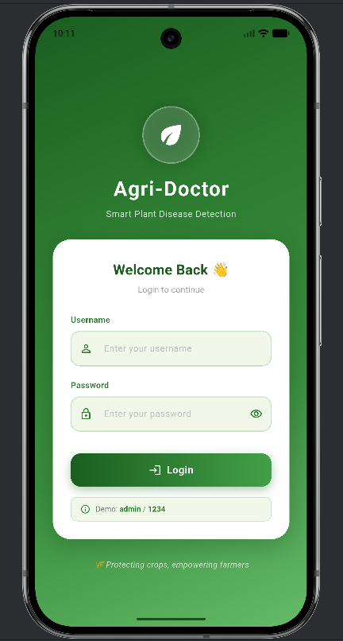
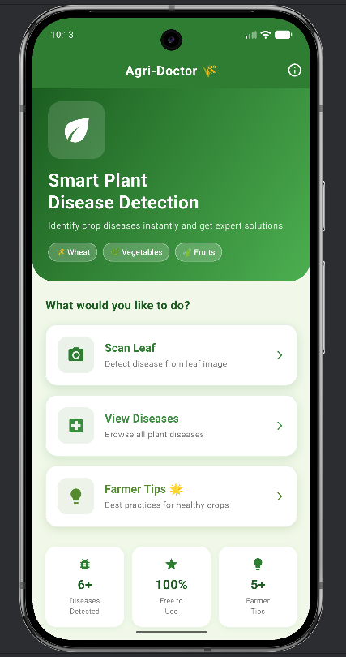
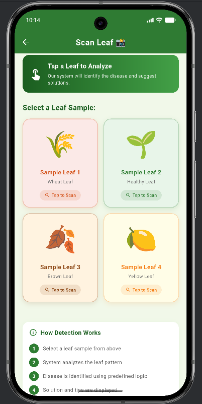
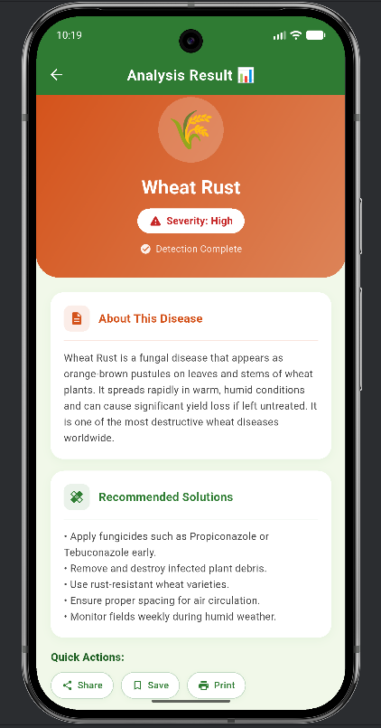
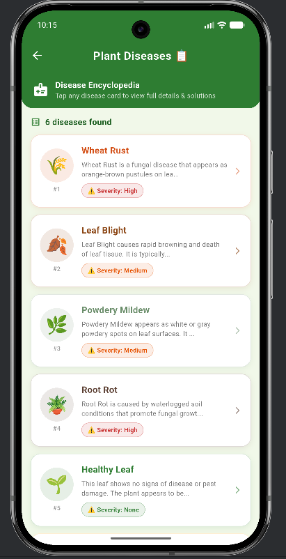
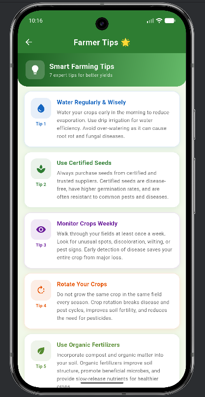

<div align="center">

# 🌾 Agri-Doctor
### Smart Plant Disease Detection Application


*A Flutter mobile application that helps farmers identify plant diseases quickly and efficiently.*

</div>

---

## 📱 Screenshots

<div align="center">

| Login | Home | Scan Leaf |
|:---:|:---:|:---:|
|  |  |  |

| Result | Disease List | Tips |
|:---:|:---:|:---:|
|  |  |  |

</div>

---

## 📋 Table of Contents

- [Overview](#-overview)
- [Features](#-features)
- [Tech Stack](#-tech-stack)
- [Project Structure](#-project-structure)
- [OOP Concepts](#-oop-concepts-demonstrated)
- [Screens](#-screens)
- [Getting Started](#-getting-started)
- [Disease Dataset](#-disease-dataset)
- [Future Enhancements](#-future-enhancements)
- [Team](#-team)

---

## 🌿 Overview

**Agri-Doctor** is a Flutter-based mobile application designed to assist farmers and agricultural professionals in identifying plant diseases quickly and efficiently. Built with Dart and Material Design 3, the app demonstrates a clean, scalable architecture based on core Object-Oriented Programming principles.

The current version uses predefined logic to **simulate AI-based disease detection**, while the architecture is designed for seamless integration with **TensorFlow Lite** for real-time machine learning inference in future iterations.

---

## ✨ Features

- 🔐 **Secure Login** — Credential-based authentication with session management
- 📸 **Leaf Scan Simulation** — Simulated AI-powered disease analysis with loading feedback
- 🦠 **Disease Encyclopedia** — Browse and search through 6 common plant diseases
- 📊 **Detailed Results** — Dynamic disease-themed result display with severity badges
- 🌟 **Farming Tips** — 7 expert agricultural tips to help maximize crop health
- 🎨 **Material Design 3** — Clean, modern green-themed UI consistent across all screens

---

## 🛠 Tech Stack

| Technology | Role |
|---|---|
| **Flutter SDK** | Cross-platform mobile framework for building the UI |
| **Dart** | Primary programming language — object-oriented & type-safe |
| **Material Design 3** | Google's design system for consistent, modern UI components |
| **StatefulWidget** | Flutter widget for managing mutable application state |
| **StatelessWidget** | Flutter widget for rendering immutable, static UI components |
| **ChangeNotifier** | Lightweight state management solution for `AuthState` |
| **Navigator / Routes** | Flutter's built-in page navigation and route management |
| **ListView.builder** | Efficient, lazily-rendered scrollable list for disease entries |
| **GridView.builder** | Grid-based layout for leaf scan sample cards |

---

## 🗂 Project Structure

```
agri_doctor/
└── lib/
    ├── assets/                        ← App screenshots
    │   ├── home.png
    │   ├── login.png
    │   ├── scan_leaf.png
    │   ├── result.png
    │   ├── disease_list.png
    │   └── tips.png
    ├── main.dart                      ← App entry point & global theme
    ├── models/
    │   └── disease.dart               ← Disease class + static dataset
    ├── screens/
    │   ├── login_screen.dart          ← User authentication UI
    │   ├── home_screen.dart           ← Main dashboard with navigation
    │   ├── scan_screen.dart           ← Leaf scan simulation (StatefulWidget)
    │   ├── result_screen.dart         ← Disease result display
    │   ├── disease_list_screen.dart   ← Browse all diseases
    │   └── tips_screen.dart           ← Farming tips encyclopedia
    └── state/
        └── auth_state.dart            ← Authentication state (ChangeNotifier)
```

### Navigation Flow

```
LoginScreen
  └── (on successful login) ──→ HomeScreen
                                    ├── Scan Leaf ──────────→ ScanScreen
                                    │       └── (tap card) ─→ ResultScreen
                                    ├── View Diseases ──────→ DiseaseListScreen
                                    │       └── (tap card) ─→ ResultScreen
                                    └── Farmer Tips ────────→ TipsScreen
```

---

## 🎓 OOP Concepts Demonstrated

Agri-Doctor implements all **four pillars of Object-Oriented Programming** in Dart:

### 1. 📦 Encapsulation — `auth_state.dart`
Private credentials and login state are hidden behind public getters and controlled methods. External code can only interact with the login state through the defined `login()` and `logout()` APIs.

```dart
class AuthState extends ChangeNotifier {
  static const String _validUsername = 'admin';  // private
  static const String _validPassword = '1234';   // private
  bool _isLoggedIn = false;                       // private

  bool get isLoggedIn => _isLoggedIn;             // controlled access
  bool login(String username, String password) { ... }
}
```

### 2. 🧩 Abstraction — `Disease` & `TipItem` Classes
Complex data is abstracted into clean, reusable model classes. The `Disease` class hides the raw data complexity and exposes a simple interface for the UI layer.

```dart
class Disease {
  String name, description, solution, iconEmoji, severity, color;
  Disease({ required this.name, required this.description, ... });
}
```

### 3. 🧬 Inheritance — Widget Hierarchy
All custom screens inherit from Flutter's base widget classes, gaining access to the full widget lifecycle.

```dart
class HomeScreen extends StatelessWidget { ... }     // inherits StatelessWidget
class ScanScreen extends StatefulWidget { ... }      // inherits StatefulWidget
class AuthState extends ChangeNotifier { ... }       // inherits ChangeNotifier
```

### 4. 🔄 Polymorphism — `build()` Method Override
Every screen overrides the `build()` method from its parent class, producing an entirely different UI from the same method signature.

```dart
// Same signature — completely different behavior per screen
@override
Widget build(BuildContext context) { ... }
// HomeScreen  → Dashboard with 3 action buttons
// ScanScreen  → 2×2 grid of leaf sample cards
// ResultScreen→ Full disease analysis layout
```

---

## 📱 Screens

| Screen | Type | Key Responsibility |
|---|---|---|
| `LoginScreen` | `StatelessWidget` | Credential validation, session start |
| `HomeScreen` | `StatelessWidget` | Navigation hub, hero banner, quick stats |
| `ScanScreen` | `StatefulWidget` | Async leaf scan simulation with loading state |
| `ResultScreen` | `StatelessWidget` | Dynamic disease-themed result display |
| `DiseaseListScreen` | `StatelessWidget` | Scrollable disease encyclopedia |
| `TipsScreen` | `StatelessWidget` | Expert farming tips with `TipItem` objects |

---

## 🚀 Getting Started

### Prerequisites

- [Flutter SDK](https://flutter.dev/docs/get-started/install) (≥ 3.0.0)
- Dart SDK (included with Flutter)
- Android Studio / VS Code with Flutter extension

### Installation

```bash
# 1. Clone the repository
git clone https://github.com/your-username/agri-doctor.git

# 2. Navigate into the project
cd agri-doctor

# 3. Install dependencies
flutter pub get

# 4. Run the app
flutter run
```

### Login Credentials

```
Username: admin
Password: 1234
```

---

## 🦠 Disease Dataset

The app includes a static dataset of 6 plant conditions:

| Disease | Severity | Description |
|---|---|---|
| 🟠 Wheat Rust | High | Fungal disease — orange-brown pustules on leaves/stems |
| 🟡 Leaf Blight | Medium | Bacterial/fungal — rapid browning and death of leaf tissue |
| ⚪ Powdery Mildew | Medium | Fungal — white/gray powdery spots blocking photosynthesis |
| 🔴 Root Rot | High | Soil-borne fungal — waterlogged roots turn dark and mushy |
| 🟢 Healthy Leaf | None | No disease detected — continue current care routine |
| 🟡 Yellow Mosaic Virus | High | Viral (whitefly-transmitted) — mosaic yellow-green patches |

---

## 🔮 Future Enhancements

| Enhancement | Description |
|---|---|
| 🤖 TensorFlow Lite | Replace simulated logic with real ML-based leaf disease detection |
| 📷 Camera API | Capture live photos using device camera for real-time scanning |
| ☁️ Firebase Backend | Cloud database for scan history and user profiles |
| 🌐 Multi-language Support | Urdu and regional language support for Pakistani farmers |
| 📶 Offline Mode | Cache disease data locally for internet-free usage |
| 💬 Expert Consultation | In-app chat to connect farmers with agricultural experts |
| 🔔 Push Notifications | Weather-based alerts for disease-favorable conditions |
| 📅 Crop Calendar | Seasonal planting calendar integrated with disease prevention tips |

---

##  Made By

| M Zain Abbas | FA23-BCS-079 |

> **Submitted To:** Ma'am Qanetah Ahmed  
> **Class:** BCS-6B  
> **Course:** Mobile App Development

